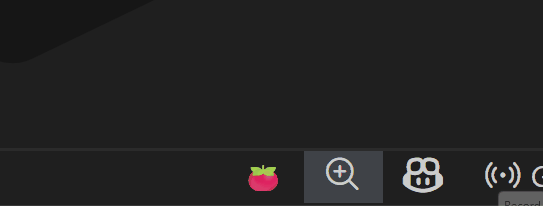
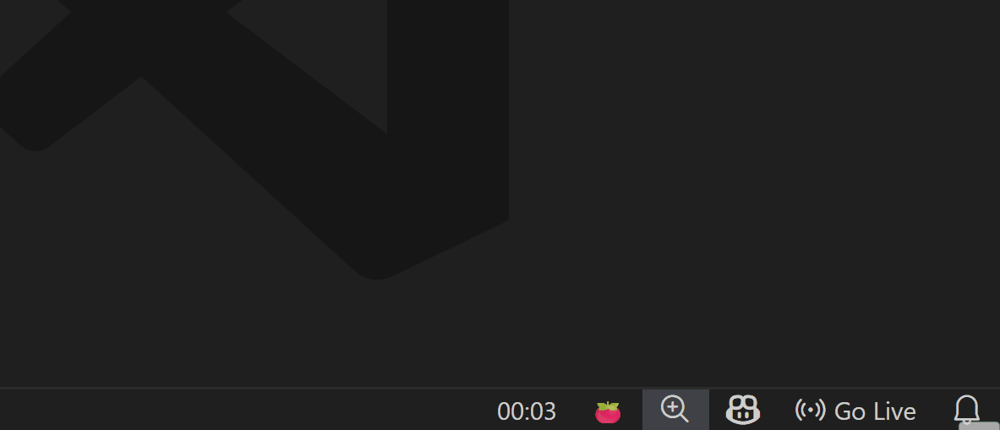

# Pomocode 🍅

**Pomocode** is a minimalist, lightweight *Pomodoro* timer for VSCode.

Start focus sessions directly from your status bar, track your time, and keep your workflow smooth without leaving the editor.

---

## Features

* **🍅 Status Bar Tomato Icon** — Start a quick Pomocode session with a single click.

* **⏱️ Work Sessions** — Default 25-minute focus sessions.

* **☕ Break Sessions** — Automatic short break prompt (default 5 minutes).

* **⏯️ Pause / Resume** — Temporarily stop the timer and resume when ready.

* **🔔 Notifications** — Clear messages when a session ends or a break is finished.

* **🕒 Clean Time Display** — HH:MM format in

## Requirements

Pomocode has no external dependencies.

- Visual Studio Code **1.106.0 or newer** is recommended. check [package.json](./package.json) for the specified engine.

## Extension Settings

Configuration options are planned for future releases.  
Current default behavior:

* Work session: **25 minutes**
* Short break: **5 minutes**

## Known Issues

* Long breaks and session intervals are not yet implemented.
* Timer state does not persist across VS Code restarts.

## Changelog

See [CHANGELOG.md](./CHANGELOG.md) for detailed release notes.

## Contributing

Bug reports, feature requests, and pull requests are welcome.  
Feel free to open an issue to share ideas or report problems.

---

**Happy focusing and productive coding! 🍅**